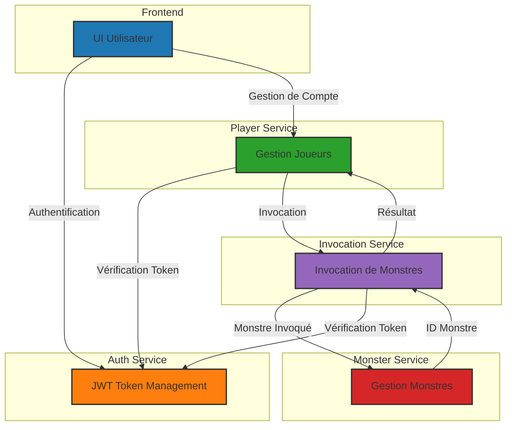

## 📌 Description
Ce projet est une application Spring Boot, un jeu  de type Gatcha qui permet aux joueurs de s'authentifier, invoquer des monstres et de gérer leurs comptes, leurs invocations, et leurs monstres.

Il repose sur une architecture microservices avec plusieurs APIs interconnectées :
- **API d'authentification** : Génération et gestion de tokens pour l'authentification.
- **API Joueur** : Gestion des informations du joueur, niveau et expérience.
- **API Monstres** : Gestion des monstres et de leurs statistiques.
- **API Invocations** : Invocation aléatoire de monstres.*
- **Frontend** : Frontend application.

---

## 🛠️ Technologies utilisées
- **Java 21**
- **Spring Boot**
- **Spring Data MongoDB**
- **OpenFeign**
- **REST API**
- **Docker**
- **MongoDB**
- **JUnit** (Tests unitaires)
- **Angular (Fetch API pour le front)**
- **Swagger**

---

## 🗺️ Architecture du Projet
Le projet est divisé en plusieurs services indépendants :
```
project-root/
├── auth-service/         # API d'authentification
├── docker-dev-env/       # API Joueur
├── eureka-server/        # Serveur Eureka
├── gatcha-frontend/      # Interface utilisateur
├── invocation-service/   # API Invocations
├── monster-service/      # API Monstres
├── player-service/       # API Joueur          
└── README.md
```

---

## 🚀 Démarrer le Projet

### Prérequis
- **Docker** et **Docker Compose**
- **Java 21**
- **Maven**

### Lancer les services
1. **Cloner le projet :**
   ```bash
   git clone https://github.com/ouzain/Gatcha-game27.git
   cd Gatcha-game27/
   ```
2. **Lancer avec Docker Compose :**
   ```bash
   cd Gatcha-game27/docker-dev-env
   docker-compose up --build
   ```
3. **Vérifier que chaque service est démarré en CLI sur docker desktop et sur le serveur eureka:**
   - Server Eureka : `localhost:8761` 
   - Auth Service : `localhost:8081`
   - Player Service : `localhost:8082`
   - Monster Service : `localhost:8083`
   - Invocation Service : `localhost:8084`
   - Frontend : `localhost:4200`

NB : toutes les API Communique avec authentification pour verifier le token à chaque appelle et player permet d'ajouter, update, authentifie un user et player communique avec toutes les autres.
Fonctionnement: 
API invocation a les monstres de bases dans les conditions initiales, lorsque le user souhaite invoquer un monstre si son niveau lui permet d'en avoir un nouveau il appelle invocation qui choisie un monstre au hasard de sa base de monstre elle l'envoie à monstre qui l'enregistre et lui renvoie l'id du monstre si l'operation est reussi ou pas cela sera enregistre dans la bdd invocation avec le statut si c'est reussi ça renvoie à player l'id enregistre dans la bdd. 
API combat n'a pas ete realise mais il y'a des endpoints dans monstres qui permettent la gestion des monstres à partir de combat.


## 📊 Schéma des Interactions



---
## 🧑‍🎮 API Joueur
Aller sur l'api player sur swagger add user **POST**/api/player/add
  - **Entrée :**  
  {
    "username": "player1",
    "password": "password123"
  }
- **Réponse (200 OK) :**  
  ```json
  {
    "Le joueur player 1 a été créé et authentifié avec succès. Voici son token player1-2025/03/15-14:25:30
  }


### Récupérer les informations du profil
**GET** `/api/player/get-user`
  "username": "player1"

---

## 🦖 Communication avec API Monstres à partir de player
### Ajouter un monstre
**POST** `/api/player//acquire-monster`
- **Entrée :**  
  ```json
  {
    "token": "player1-2025/03/15-14:25:30" ,
  }
  ```

---

## 💻 Frontend
###

}
```
---

## 💡 Contributeurs
- **Ousmane** 
- **Amanie SAID**
- **Enide Djender**
- **Islem Sadki**


---

# 🐉 Projet Gatcha d'Invocation de Monstres

## 📌 Description

Ce projet est une application Spring Boot, un jeu de type Gatcha qui permet aux joueurs de s'authentifier, d'invoquer des monstres et de gérer leurs comptes, leurs invocations et leurs monstres.

Il repose sur une architecture microservices avec plusieurs APIs interconnectées :

- **API d'authentification** : Génération et gestion de tokens pour l'authentification.
- **API Joueur** : Gestion des informations du joueur, niveau et expérience.
- **API Monstres** : Gestion des monstres et de leurs statistiques.
- **API Invocations** : Invocation aléatoire de monstres avec gestion des probabilités.

---

## 🛠️ Technologies utilisées

- **Java 21**
- **Spring Boot**
- **Spring Data MongoDB**
- **OpenFeign**
- **REST API**
- **Docker**
- **MongoDB**
- **JUnit** (Tests unitaires)
- **Angular (Fetch API pour le front)**
- **Swagger**

---

## 🗺️ Architecture du Projet

Le projet est divisé en plusieurs services indépendants :

```
project-root/
├── auth-service/         # API d'authentification
├── docker-dev-env/       # Environnement de développement Docker
├── eureka-server/        # Serveur Eureka
├── gatcha-frontend/      # Interface utilisateur
├── invocation-service/   # API Invocations
├── monster-service/      # API Monstres
├── player-service/       # API Joueur
└── README.md
```

---

## 🚀 Démarrer le Projet

### Prérequis

- **Docker** et **Docker Compose**
- **Java 21**
- **Maven**

### Lancer les services

1. **Cloner le projet :**
   ```bash
   git clone https://github.com/username/monster-invocation.git
   cd Gatcha-game27/
   ```
2. **Lancer avec Docker Compose :**
   ```bash
   cd Gatcha-game27/docker-dev-env
   docker-compose up --build
   ```
3. **Vérifier que chaque service est démarré en CLI sur docker desktop et sur le serveur eureka :**
   - Server Eureka : `localhost:8761`
   - Auth Service : `localhost:8081`
   - Player Service : `localhost:8082`
   - Monster Service : `UI Utilisateu:8083`
   - Invocation Service : `localhost:8084`
   - Frontend : `localhost:4200`

---

## 📊 Schéma des Interactions


